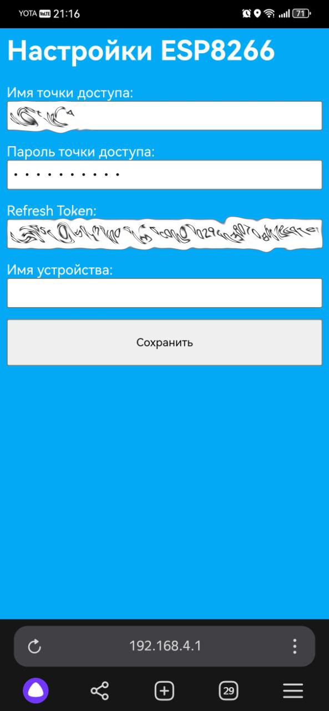
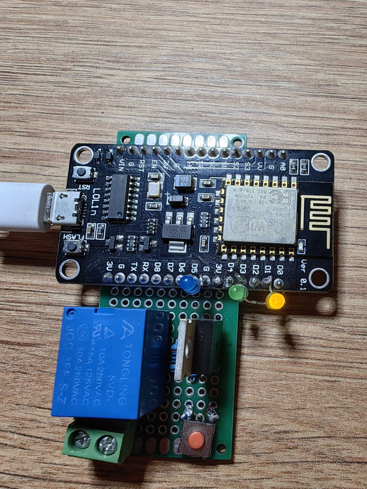
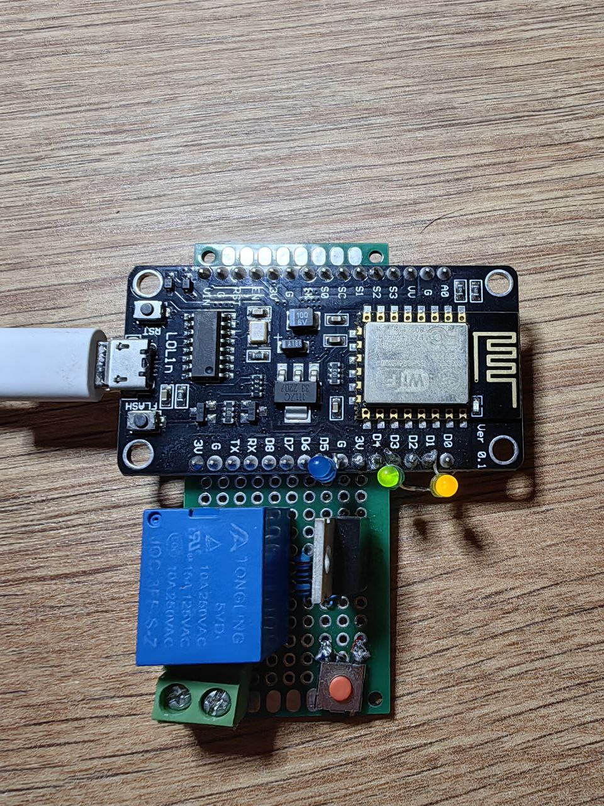
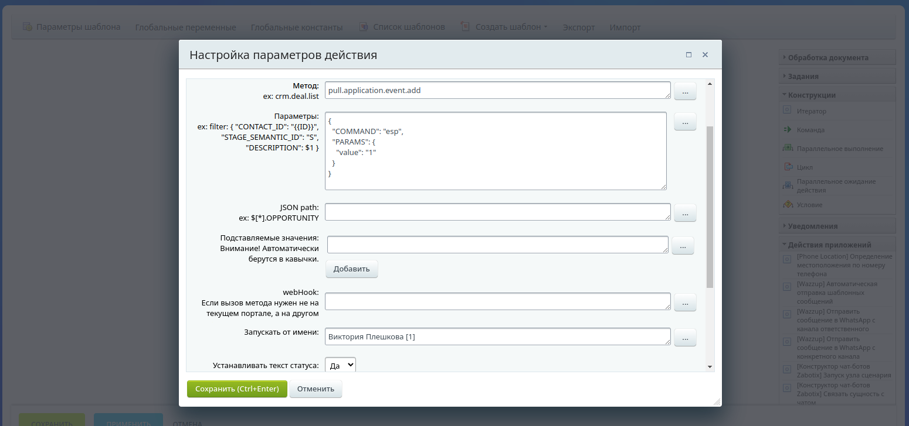

+++
title = 'Bitrix24 - облако не приговор (часть 1)'
description ='Пример кастомизации облачного битрикс24 за счёт использования микроконтроллера esp8266'
date = 2024-06-03T04:04:16.147Z
draft = false
tags = ['bitrix24', 'облако', 'эксперементы', 'esp']
categories = ['блог']
+++
## Disclaimer

Описанное ниже, не является руководством к действию, не испытано на практике и по сути является лишь демонстрацией возможностей облачных порталов Bitrix24.


Этот проект задумывался ещё когда порталы Bitrix24 с бесплатным тарифом позволяли использовать REST api.

## Идея

Задумка следующая. В bitrix24 есть механизм PushAndPull (по сути это обычный websocket). Он используется для работы мессенджера, обновления данных в карточках "на лету" и обмена с 1с "в режиме реального времени".

Касательно 1с - это скорее ухищрение, к которому прибегли из-за того, что не каждую 1с есть возможность открыть наружу (да и не все хотят). Поэтому происходит следующее:

В качестве токена доступа мы вводим refresh_token (тот код что просит ввести обмен 1с)
По этому токену 1с получает данные домена (обращаясь к серверу авторизации битрикс)
По полученным авторизационным данным - получаем параметры подключения к веб-сокету
Слушаем сообщения в реальном времени
Так вот, что если, проделать тот же путь что и 1с, но в конечном итоге слушать не события битрикса для их обновления, а например, управлять устройствами умного дома?


Повторюсь. Идея бредовая. Не делайте умный дом на битрикс24. Пожалуйста. 


## Нам понадобится:

- Модуль с wi-fi на борту. Я взял esp-8266 (просто потому что попался первым под руку)
- Реле (так же выбирал из того что было)
- Транзистор (не хватало мощности клацать напрямую реле, поэтому IRF-3205)
- Кнопка
- Клемма
- 3 светодиода
Всё это было собрано на макетной плате, в черновом виде, просто потому что изначально задумывалось как шалость.

Приводить схему соединения всего этого не буду, по сути транзистор подключен к выводу D6, и управляет реле. Кнопка задумывалась как сброс настроек (для включения в режиме точки доступа). Остальное ниже - по коду.

## Код
Функция setup инициализирует пины, устанавливает callBack-функции веб-сокета (их рассмотрим ниже) и пробует считать из энергонезависимой памяти данные подключения к wi-fi и битрикс 24. Если зажата кнопка (которую мы подключили на вывод D7) - то эти параметры игнорируются и стартует сервер.

```cpp{linenos=table}
void setup()
{
    // ----- ТУТ был код инициализации пинов ------
    int valueButton=digitalRead(BTN_PIN);

    //установка callback функций
    webSocketClient.onMessage(onMessageCallback);
    webSocketClient.onEvent(onEventsCallback);
    //по умолчанию реле выключено
    digitalWrite(RELE_PIN, LOW);

    delay(500);
    //храним в том же порядке ssid, pass, refresh, device
    ssid=readStringFromEEPROM(0, SSID_LENGTH);
    Serial.println("ssid:\""+ssid+"\"");

    //Если кнопка не нажата и ssid заполнен 
    if (!valueButton&&!ssid.isEmpty()){
        password=readStringFromEEPROM(SSID_LENGTH, PASS_LENGTH);
        refresh_token=readStringFromEEPROM(PASS_LENGTH, REFRESH_LENGTH);
        deviceName=readStringFromEEPROM(REFRESH_LENGTH, DEVICE_LENGTH);
    }
    else{// Иначе - запускаем в режиме точки доступа
        startServer();
        serverStarted=true;
    }
}
```

Главный цикл программы. Проверяем подключены ли мы к wi-fi, если нет - проверяем запущен ли контроллер в режиме точки доступа, если нет - пытаемся подключиться к wi-fi.
```cpp{linenos=table}
void loop(){
    if (WiFi.status() == WL_CONNECTED) {
        webSocketClient.poll();
    }
    else{
        if (serverStarted)
            server.handleClient();
        else{
            tryConnectToWifi();
        }
    }
}
```

Так как при первом включении ssid будет пустым, сразу рассмотрим что из себя представляет функция startServer и handleClient:
```cpp{linenos=table}
void startServer(){//Стандартная функция точки доступа из примеров
    // Запуск собственной точки доступа (Access Point)
    WiFi.mode(WIFI_AP);
    WiFi.softAP(apSsid, apPassword);
    delay(100); // Небольшая задержка для установки соединения
    server.on("/", handleRoot);
    server.begin();
    delay(500);
    Serial.println(WiFi.softAPIP());
}

void handleRoot(){
    if(server.method()==HTTP_POST){//Если пост - сохраняем параметры, иначе - отдаём страничку настроек
        handleSave();
    }
    else{
        sendPage();
    }
}

void sendPage(){//Отправляет страничку в виде
    String html = "<html><head>";
    html += "<meta charset='utf-8'>";
    html += "<meta name='viewport' content='width=device-width, initial-scale=1'>";
    html += "</head>";
    html += "<body style=\"background: #03a9f4; color: #fff; font-family: sans-serif;\">";
    //---------- Тут ещё десяток таких же красивых строк ----------
    html += "</body></html>";
    server.send(200, "text/html", html);
}

void handleSave(){
    ssid = server.arg("ssid");
    password = server.arg("password");
    refresh_token = server.arg("refresh_token");
    deviceName = server.arg("deviceName");

    writeStringToEEPROM(REFRESH_LENGTH, deviceName);
    String html = "<html><head>";
    html += "<meta charset='utf-8'>";
    html += "<meta name='viewport' content='width=device-width, initial-scale=1'>";
    html += "</head>";
    html += "<body>Настройки сохранены</body></html>";
    server.send(200, "text/plain", html);

    serverStarted=false;
}
```

После сохранения параметров микроконтроллер попробует подключиться к wi-fi. Функция  вцелом стандартная, так же взята из примеров работы с wi-fi модулем. С разницей лишь в том, что после
10 секунд, если не получилось подключиться к wi-fi, снова стартует режим точки доступа для изменения настроек. Если подключиться удалось - обновляем refresh токен.
```cpp{linenos=table}
void tryConnectToWifi(){
    serverStarted=false;
    WiFi.mode(WIFI_STA);

    WiFi.begin(ssid, password);
    int i=0;
    
    while (WiFi.status() != WL_CONNECTED) {
        Serial.println("Подключение к Wi-Fi..."+' '+ssid+' '+password);
        i++;
        delay(1000);
        if (i>=10){
            startServer();
            serverStarted=true;
            return;
        }
    }
    //Если подключились - сохраняем параметры wifi
    writeStringToEEPROM(0, ssid);
    writeStringToEEPROM(SSID_LENGTH, password);
    //Включаем первый светодиод
    digitalWrite(LED1_PIN, HIGH);
    //Обновляем refresh_token
    refreshAndConnect();
}

void refreshAndConnect(){
    delay(500);
    ResultRefresh result=refreshToken(refresh_token);
    if (result.access_token.isEmpty()||result.refresh_token.isEmpty()){
        startServer();
        serverStarted=true;
        return;
    }
    refresh_token=result.refresh_token;
    writeStringToEEPROM(PASS_LENGTH, refresh_token);
    client_endpoint=result.client_endpoint;
    access_token=result.access_token;
    SocketParams socketParams=getSocketParams(client_endpoint, access_token);

    webSocketClient.setInsecure();
    webSocketClient.ping();
    webSocketClient.connect(socketParams.server+"?CHANNEL_ID="+socketParams.chanel+"&clientId="+getClientId());
}
```

Выше я не описываю refreshToken и getSocketParams, так как это типовые вызовы rest, но очень объёмные.
refreshToken - делает обращение к https://oauth.bitrix.info/oauth/token/?grant_type=refresh_token
getSocketParams - делает обращение к https://{ваш портал}//rest/pull.application.config.get

И последнее - две callback функции.
```cpp{linenos=table}
void onMessageCallback(WebsocketsMessage message) {
    String bodyRaw=message.data();
    bodyRaw.replace("#!NGINXNMS!#", "");
    bodyRaw.replace("#!NGINXNME!#", "");
    Serial.println(bodyRaw);
    DynamicJsonDocument doc(2024);
    DeserializationError error = deserializeJson(doc, bodyRaw);

    if (error)
    {
        Serial.print("Ошибка разбора JSON: ");
        Serial.println(error.c_str());
    }
    else{
        // Доступ к значениям JSON
        String command=doc["text"]["command"].as<String>();
        if (command=="esp"){
            String device=doc["text"]["params"]["device"].as<String>();
            if (device==deviceName||deviceName.isEmpty()){
                String value=doc["text"]["params"]["value"].as<String>();

                if(value=="1"){
                    digitalWrite(RELE_PIN, HIGH);
                }
                else{
                    digitalWrite(RELE_PIN, LOW);
                }
                Serial.println("Message params: "+command+" device: "+device+" value: "+value);
            }
        }

        Serial.println("Input message");

        digitalWrite(LED5_PIN, HIGH);
        delay(1000);
        digitalWrite(LED5_PIN, LOW);
    }
}

void onEventsCallback(WebsocketsEvent event, String data) {
    if(event == WebsocketsEvent::ConnectionOpened) {
        digitalWrite(LED3_PIN, HIGH);
        Serial.println("Connnection Opened");
    } else if(event == WebsocketsEvent::ConnectionClosed) {
        refreshAndConnect();
    } else if(event == WebsocketsEvent::GotPing) {
        Serial.println("Got a Ping!");
    } else if(event == WebsocketsEvent::GotPong) {
        Serial.println("Got a Pong!");
    }
}
```

То есть при подключении загорается светодиод подключенный к D3. 
При получении сообщения отрабатывает функция, которая пробует разобрать json, и если команда и id устройства (в случае если их несколько) совпадает - переключить на значение value реле.

## Запуск и тестирование
### Первое включение
При первом запуске появляется страничка настройки где необходимо ввести параметры подключения к wi-fi и refresh_token приложения.
<div class="flex justify-center">
    
</div>

После сохранения настроек, микроконтроллер должен перезагрузится (телефон сам отключится от точки доступа), а на плате по очереди загорится первый (успешно подключились к wi-fi) и второй (успешно подключились к битриксу) светодиоды.
<div class="flex justify-center">
    
    
</div>

Далее, в качестве теста нам необходимо переключиться в окно приложения и отправить следующую команду:
```javascript
BX24.callMethod('pull.application.event.add', {
	'COMMAND': 'esp',
	'PARAMS': '{"value":"1"}',
}, function(result){
	console.log(result);
});
```
На каждое сообщение на 1 секунду загорается синий светодиод. При изменении значения в поле value - получаем получаем соответствующее логическое значение нагрузки.
<div class="flex justify-center">
    
</div>

### Подключение нагрузки
В идеале к нагрузке было бы подключить лампочку, у неё и ток больше чем у зарадки, и выглядит нагляднее, но лампочки под рукой не нашлось.


### Больше дичи
Так как управление нагрузкой теперь работает в рамках Битрикс24, управлять нагрузкой мы можем через бизнес процесс. Например:

<div class="flex justify-center">
    
</div>

То есть, мы можем включать нагрузку при наступлении каких-то условий в бп. Например, при создании лида, мы можем засечь час времени, и через час повторно проверить статус лида. Если статус не был изменён, включать нагрузку для физического воздействия на менеджера.

На этом всё. Кто осилил - тот умничка.