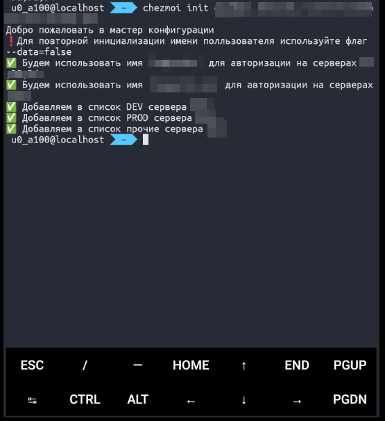

+++
title = 'SSH с мобильного. Мой путь.'
description ='Подключение по ssh с мобильного. Мой путь.'
date = 2024-07-28T13:28:31.595Z
draft = false
tags = ['SSH', 'termux', 'chezmoi']
categories = ['блог']
+++

## Преамбула
Наверное, всего того, что описано ниже, не было, если бы я придерживался хоть какого-то work-life balance. А пока мне нужен доступ к серверам, часто в любое время, в любом месте. Речь не о том, чтобы программировать с телефона (хотя в качестве примера это тоже рассмотрим), а скорее о перезапуске какой-нибудь службы или убийстве зависшего процесса. Впрочем, обо всём по порядку.

## Шаринг доступов SSH
### Путь
За время работы в разных компаниях я видел разные способы шаринга доступов к серверам. У кого-то это были Google-таблицы с логинами и паролями, у кого-то самописные шифровальщики паролей. Мы долгое время использовали Passbolt (что хоть и решало проблему, но только частично). В целом, на рабочих серверах большому числу людей делать нечего. Те же разработчики по идее выливают изменения через CI/CD. Но даже если у вас всего один системный администратор, хотелось бы:
1. Иметь одинаковые учетные записи на всех серверах (причем отдельные под каждого пользователя)
2. Доступ осуществлялся через ключи
3. Данные о ip адресах и портах не приходилось тягать вручуную

Как результат, мы пришли к следующей модели:
1. Создаём группу по названию компании (ansible)
2. Создаём пользователей, прописываем их ключи и добавляем в группу (ansible)
3. Проверяем есть ли в группе пользователи вне списка, их удаляем (например при увольнении) (ansible)
4. Записываем хост в конфиг chezmoi и шарим по машинам

Описывать часть Ansible я не буду, так как наше решение все ещё не идеальное, оно скорее закрывало наши боли в моменте. А вот Chezmoi интересный инструмент, который я опишу ниже.

### Chezmoi
Независимо от того, на какой платформе вы работаете, ваш SSH-конфиг хранится в ~/.ssh/. Более того, формат для Linux и Windows одинаковый. Теоретически можно хранить свежую версию config файла в Git, и это закроет большую часть потребностей. Но очень скоро захочется:
1. Разделить ssh ключи на группы
2. Иметь возможность подмены всяких переменных

Тут то мне и попался на глаза <a href="https://www.chezmoi.io/">chezmoi</a>.

#### Этап 1. Файл инициализации.
Вы можете определить файл, который интерактивно запросит глобальные переменные у пользователя при инициализации. У меня это было что-то типа:
```go{linenos=table}
{{- writeToStdout "Добро пожаловать в мастер конфигурации\n" -}}
{{- writeToStdout "❗️Для повторной инициализации имени полльзователя используйте флаг --data=false\n" -}}


{{- /* Ввод пользователя {n} серверов */ -}}
{{- $d_server_user := promptStringOnce . "d_server_user"  "Введите имя пользователя для внутренних серверов:" -}}
{{- if $d_server_user -}}
{{-     writeToStdout (printf "✅ Будем использовать имя '%s' для авторизации на внутренних серверах\n" $d_server_user) -}}
{{- else -}}
{{-     writeToStdout "❌ Имя пользователя .. не указано\n" -}}
{{- end -}}


{{- /* Ниже ещё несколько вопросов, например касательно групп подключаемых серверов */ -}}
```

Теперь при первом запуске инициализации chezmoi запросит базовые переменные.
<div class="flex justify-center">
    
</div>

#### Этап 2. Создание шаблона
Не хочется сводить статью к цитированию документации. Я не уверен, что статья не устарела на тот момент, как я её опубликовал. Но основную мысль передам. Chezmoi использует шаблонизатор Go. Если вы с ним не знакомы - это не проблема, в документации есть множество примеров.
```go{linenos=table}
#SHARED CONFIG REGION START
{{ if .otherEnable -}}
Host ТутНазваниеХоста
    HostName тутIpАдресИлиДомен
    ProxyCommand ssh -W %h:%p ТоЧерезЧтоПроксируем
    User {{.d_server_user}}
    Port 62626
{{end}}
```
В целом стандартная структура файла .ssh, за исключением
1. {{ if .otherEnable -}} ... {{end}} - Условный блок, что означает что сервер не будет включён в файл у тех пользоветелей, которые указали что им доступ на сервера other не нужны.
2. {{.d_server_user}} - наша переменная

То есть ключ пользователя добавлен на сервер под его учётной записью (чаще всего фамилия.ио). А сами параметры подключени пользователь получает через chezmoi.

#### Этап 3. Подключение полученного файла.
Этот этап на первых порах вызвал некоторые проблемы, так как не хотелось получать ошибку совместимости файлов после того, как пользователь допишет своих параметров в SSH. Однако было найдено простое решение. Конфигурацию SSH мы прописываем не в файл ```~/.ssh/config``` а рядом в ```~/.ssh/share_config```. И подключаем скриптом (run_apply.sh):
```bash{linenos=table}
#!/bin/sh
stringSearch='include shared_config';
if [ -f ~/.ssh/config ]; then
    if grep -q "$stringSearch" ~/.ssh/config; then
        echo "✅ Includ уже прописан в вашем ~/.ssh/config";
    else
        sed -i "1s/^/$stringSearch\n/" ~/.ssh/config;
        echo "❗️ Includ прописал в вашем ~/.ssh/config";
    fi
else
    echo "$stringSearch" > ~/.ssh/config
    echo "❗️ Создал ~/.ssh/config";
fi
```

Как только появился скрипт sh - сразу возник вопрос совместимости с windows. И пришлось добавить следующие строки в `.chezmoi.json.tmpl`:
```go{linenos=table}
{
    "data":{
        ...
    },
    "interpreters":{
        "sh":{
            {{- if eq .chezmoi.os "linux" -}}
            "command":"bash"
            {{- if eq .chezmoi.os "android" -}}
            "command":"bash"
            {{- else -}}
            "command":"C:\\Program Files\\Git\\bin\\sh.exe"
            {{- end -}}
        }
    }
}
```

Теперь, при применении конфигурации chezmoi запускает скрипт, который пытается прописать `include shared_config` в файл `~/.ssh/conf`. 

#### Цикл работы
1. При появлении нового сервера или сотрудника прогоняем Ansible по серверам, создавая пользователей и добавляя им ключи
2. Сотрудник устанавливает Chezmoi и пишет в консоли `chezmoi init`. Ответив интерактивно на вопросы, уже может подключаться к любому доступному серверу (список доступных серверов виден в файле). Если вы ранее не работали с ~/.ssh/conf, то для вас будет приятный бонус, так как для подключения к серверу теперь вместо `ssh root@myserver.ru -p 242321` достаточно ввести `ssh myserver.ru`. 
3. Сотрудник увольняется. Мы также прогоняем Ansible по серверам, и он удаляет пользователя.

Повторюсь, у этой системы есть недостатки, но это закрывает базовые потребности без необходимости внедрения полноценного LDAP.

### При чём здесь телефон.
Теперь, имея способ шаринга доступов, можно шарить их везде. Например, на телефоне (если у вас не iPhone, конечно).

Устанавливаем termux. Тут нет никаких подводных камней. Он доступен в маркете, но важно!, устанавливать его из <a href="https://f-droid.org/">f-droid</a>.
Если установить Termux из маркета, то дополнения будут платными. Если установить Termux из маркета, а дополнения из F-Droid, будут конфликты. Сразу можно установить Termux: далее - мой путь (не гайдлайн).

0. Что бы избежать возможных проблем `pkg update` и `pkg upgrade`
1. Устанавливаем zsh, git, curl, wget
```bash
pkg install zsh git curl wget
```
1.1. Вам может понадобится vim. Я использую AstroVim.
```bash
pkg install neovim
git clone --depth 1 https://github.com/AstroNvim/template ~/.config/nvim
rm -rf ~/.config/nvim/.git
#Почему-то когда я писал статью, не подтянул в зависимости си. Установим вручную
pkg install clang zig
```
2. Устанавливаем <a href="https://github.com/ohmyzsh/ohmyzsh">ohmyzsh</a>
```bash
sh -c "$(curl -fsSL https://install.ohmyz.sh/)"
```
3. Используем zsh по умолчанию
```bash
chsh -s zsh
```
 зависимости от темы могут понадобиться дополнительные шрифты. Об этом описано на странице zsh. Обычно это сводится к клонированию репозитория и запуску install.sh. Перед установкой стоит попробовать выбрать шрифт через стилизацию (долгий тап - More - Style). Тут же меняется цвет фона.
4. Наконец установка самого chezmoi
```bash
pkg install chezmoi
```
5. Инициализация вашей конфигурации:
```bash
chezmoi init ссылка_на_ваш_репозиторий
```
<div class="flex justify-center flex-wrap">
    
</div>

### Дичь (я попытаюсь добавить её в каждой статье)
#### Верстать адаптив сразу на телефоне
Termux по сути позволяет запустить Node.js. Vue из-под Vite не завёлся, ругаясь на компилятор ESLint (кажется, это мелкая устранимая проблема, но честно говоря...). А вот проект на Vue2 завелся без проблем. Открыв вторую вкладку Termux, можно править файлы и даже watch отрабатывает корректно. Смотреть результат можно тут же в окне браузера:
<div class="flex justify-center flex-wrap">
    
    
    
    
</div>

#### Сидеть в интернете через консольный браузер
Я попробовал установить Browsh, но он отказался запускаться (не видел Firefox). А вот Lynx запустился. Вот, например, этот блог:
<div class="flex justify-center flex-wrap">
    
</div>

#### Шалость не удалась
В максимальном угаре хотелось запустить Docker и в нём какую-то весомую серверную часть. Судя по гайдам в интернете, это возможно, но подразумевает, что через QEMU будет поднят образ Alpine, и уже в нём Docker. Я, честно говоря, не настолько упорот в данный момент. Возможно, когда-нибудь.